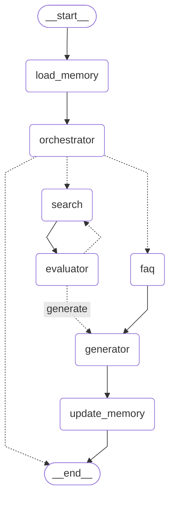

# E-commerce Personal Shopper Agent

[](https://www.python.org/downloads/)
[](https://qdrant.tech/)
[](https://www.langchain.com/)

An intelligent e-commerce personal shopping assistant that leverages a Retrieval-Augmented Generation (RAG) pipeline for semantic product search and contextual recommendations. This system understands natural language queries, maintains conversation context, and provides personalized shopping assistance.

## 🌟 Key Features

- **Semantic Product Search**: Find products using natural language queries in both English and Arabic
- **Context-Aware Conversations**: Maintains conversation history to understand follow-up requests
- **Intelligent Filtering**: Automatically filters by category, price, brand, and ratings
- **Multi-Model Architecture**: Uses different embedding models for products and FAQs
- **Smart Evaluation**: Validates search results using LLM-based quality assessment
- **Multi-Lingual Support**: Handles both English and Arabic queries seamlessly

## 🚀 Project Overview

This project implements a sophisticated semantic search engine designed specifically for e-commerce applications. It combines the power of sentence transformers for text embeddings with Qdrant's vector database capabilities to deliver accurate, context-aware search results for both product discovery and FAQ question-answering.

### Architecture



## 🎯 Problem Statement & Solution Journey

### Challenge 1: Contextual Conversation Management

**Problem**: Users often make follow-up requests like "show me something else" or "no price less than this" that require understanding the previous conversation context.

**Solution**: 
- Implemented a working memory system that maintains the last 4 conversation exchanges
- Created a query refinement mechanism that uses LLM to interpret vague requests in context
- Added Arabic language support for common vague phrases like "غير كده" and "مفيش سعر اقل من كده"

**Technical Implementation**:
- Custom [working_memory.py](src/agents/workflows/working_memory.py) module that loads and updates conversation context
- [conversation_aware_search.py](src/agents/tools/conversation_aware_search.py) tool that refines queries using conversation history
- Integration with all workflow nodes to ensure context persistence

### Challenge 2: Optimizing Retrieval Accuracy

**Problem**: Initial semantic search results had poor relevance for specific user queries, especially with the large product catalog.

**Solution**:
- Implemented a two-stage search process: initial retrieval followed by cross-encoder re-ranking
- Used different embedding models for different data types (large model for products, small for FAQs)
- Configured appropriate vector dimensions (1024 for products, 384 for FAQs)

**Technical Implementation**:
- [SemanticSearch](src/vector_db/search.py) class with configurable re-ranking
- BAAI/bge-reranker-base cross-encoder for relevance scoring
- Multi-model embedding configuration in [config.py](src/vector_db/config.py)

### Challenge 3: Memory Persistence & Vector Database Integration

**Problem**: Ensuring reliable data persistence and efficient querying in the vector database while handling large batch operations.

**Solution**:
- Implemented batch processing with configurable batch sizes (default 64)
- Added robust error handling and retry mechanisms
- Created separate collections for products and FAQs with appropriate configurations

**Technical Implementation**:
- [VectorStore](src/vector_db/vector_store.py) class with batch processing
- Automatic collection creation with proper vector dimensions
- SQLite database integration for product data loading

### Challenge 4: Agent Workflow Orchestration

**Problem**: Complex state management and conditional routing in the LangGraph-based agent system.

**Solution**:
- Implemented a robust state graph with proper error handling and retry logic
- Created intelligent evaluation nodes that validate search results
- Added conversation memory updates at appropriate workflow points

**Technical Implementation**:
- [graph.py](src/agents/graph.py) with conditional edges and state management
- [evaluator_node.py](src/agents/workflows/evaluator_node.py) with LLM-based result validation
- Retry mechanism with maximum attempt limits

## 📊 Performance Metrics & Results

### Retrieval Accuracy Metrics

#### Product Retrieval Performance
```
Embedding Model: intfloat/multilingual-e5-small
Total Questions: 20
Hit Rate @10: 75.00%
Mean Reciprocal Rank (MRR): 0.6042

Embedding Model: intfloat/multilingual-e5-large
Total Questions: 20
Hit Rate @10: 80.00%
Mean Reciprocal Rank (MRR): 0.6542
```

## 🔧 Technical Architecture

### Core Components

1. **Vector Database Layer** ([src/vector_db/](src/vector_db/))
   - Qdrant Cloud integration for vector storage and retrieval
   - Multi-model embedding support (intfloat/multilingual-e5-small/large)
   - Batch processing for efficient data loading

2. **Agent Workflow Layer** ([src/agents/](src/agents/))
   - LangGraph-based state management
   - Conversation memory persistence
   - Intelligent result evaluation and filtering

3. **Data Processing Layer** ([db/](db/), [data/](data/))
   - SQLite database for product data storage
   - JSON processing for FAQ data
   - HTML parsing for product specifications

### Key Technical Decisions

- **Qdrant Cloud**: Chosen for production-ready vector database capabilities
- **Sentence Transformers**: Used for multilingual embedding generation
- **LangGraph**: Implemented for complex agent workflow orchestration
- **Cross-Encoder Re-ranking**: Added to improve search result relevance
- **Modular Design**: Separate components for ingestion, chunking, storage, and retrieval

## 🛠️ Installation & Setup

### Prerequisites

- Python 3.12
- Qdrant Cloud account (or self-hosted instance)
- pip package manager

### Quick Start

```bash
# Clone the repository
git clone <repository-url>
cd e-commerce-personal-shopper-agent

# Install dependencies
pip install -r requirements.txt

# Configure environment variables
cp .env.example .env
# Edit .env with your Qdrant credentials and API keys

# Initialize database
cd db
python init_db.py

# Load data into vector database
cd ../src/vector_db
python main.py

# Start the agent
cd ../agents
python graph.py
```

## 🧪 Testing & Validation

The system includes comprehensive testing for all components:

1. **Vector Database Testing**: Validation of embedding generation and storage
2. **Search Accuracy Testing**: Evaluation of retrieval relevance scores
3. **Conversation Context Testing**: Verification of memory persistence
4. **Agent Workflow Testing**: End-to-end validation of user interactions


## 📁 Project Structure

```
src/
├── vector_db/              # Vector database core modules
│   ├── __init__.py         # Package initialization
│   ├── config.py           # Configuration management
│   ├── embedding.py        # Text embedding generation
│   ├── vector_store.py     # Qdrant database operations
│   ├── search.py           # Search functionality with reranking
│   ├── utils.py            # Data processing utilities
│   ├── main.py             # Main module with examples
│   └── output_metrices/    # Performance metrics
│       └── products_retrieval.txt  # Product retrieval metrics
├── agents/                 # LangGraph agents for complex workflows
│   ├── tools/              # Agent tools integrated with vector_db
│   ├── workflows/          # Agent workflow definitions
│   ├── schemas/            # Data schemas for agents
│   ├── prompts/            # LLM prompts
│   ├── graph.py            # Agent graph definition
│   └── config.py           # Agent configuration
└── utils/                  # General utility functions

data/
├── raw/                    # Raw data files (FAQ JSON, etc.)
└── processed/              # Processed data files

db/
├── init_db.py              # Database initialization
├── schema.sql              # Database schema
└── ecommerce_products.db   # SQLite database file

api.py                      # FastAPI backend

requirements.txt            # Python dependencies
.env.example                # Environment variable template
```

## 🌐 Full-Stack Development with Cursor AI

This project includes a complete full-stack implementation with both frontend and backend components:

### React Frontend
- Developed with React.js for a responsive user interface
- Built with assistance from Cursor AI for accelerated development
- Features intuitive product search and filtering capabilities
- Real-time interaction with the backend API

### FastAPI Backend
- RESTful API built with FastAPI for high performance
- Integrates with the e-commerce personal shopper agent
- Provides endpoints for product search and recommendations
- Handles natural language queries and returns structured responses

### Development Process
- Leveraged Cursor AI for code generation and refactoring
- Accelerated development with AI-assisted debugging
- Maintained code quality through AI-guided best practices
- Streamlined workflow with intelligent code suggestions

## 🙏 Thanks

