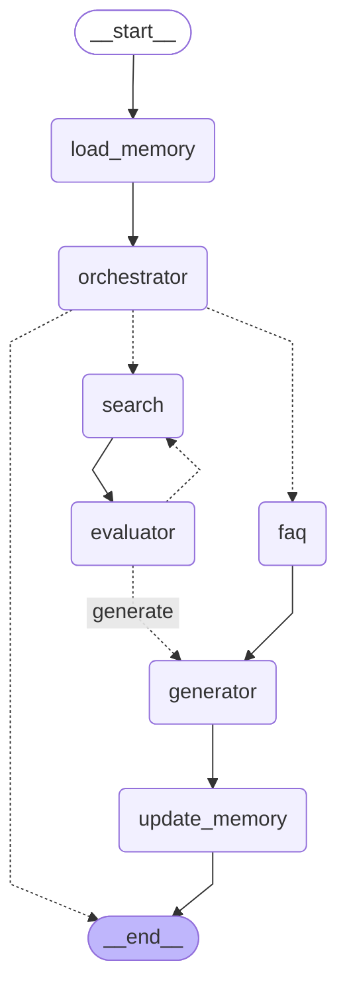

```mermaid
---
config:
  flowchart:
    curve: linear
---
graph TD;
	__start__([<p>__start__</p>]):::first
	load_memory(load_memory)
	orchestrator(orchestrator)
	search(search)
	evaluator(evaluator)
	generator(generator)
	faq(faq)
	update_memory(update_memory)
	__end__([<p>__end__</p>]):::last
	__start__ --> load_memory;
	evaluator -. &nbsp;generate&nbsp; .-> generator;
	evaluator -.-> search;
	faq --> generator;
	generator --> update_memory;
	load_memory --> orchestrator;
	orchestrator -.-> __end__;
	orchestrator -.-> faq;
	orchestrator -.-> search;
	search --> evaluator;
	update_memory --> __end__;
	classDef default fill:#f2f0ff,line-height:1.2
	classDef first fill-opacity:0
	classDef last fill:#bfb6fc

```